# DATA PREDICTION AND ANALYSIS - SWIGGY & ZOMATO

By - Siddhanth Biswas 2024-03-10

Insights!

1. Customers with more frequent purchases have a more recent purchase

For a particular customer (measured in seconds):

- Transaction Frequency = (last transaction time - first transaction time) / (Number of transactions - 1)
- Last purchase diff = last possible time to purchase - time of last purchase
  - Note: last possible time to purchase here is '2023-12-31 23:59:59+0000'

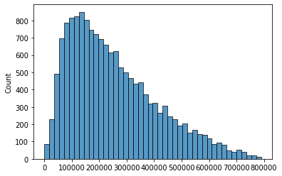

Fig. Transaction Frequency histogram

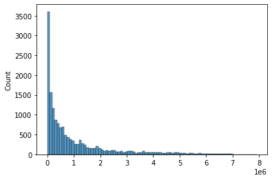

Fig. Last purchase diff histogram

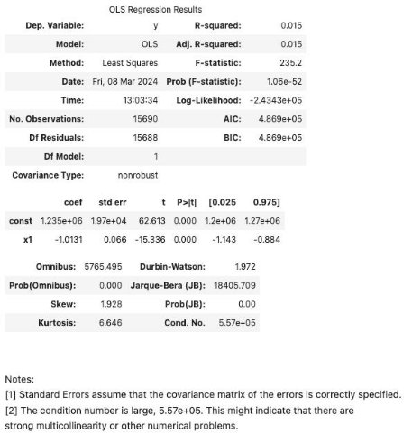

Fig. OLS regression results between transaction frequency and last purchase diff

OLS (Ordinary Least Squares) regression is done to measure the relationship between transaction frequency and last purchase diff.

The relationship between frequency of purchase and last purchase difference is statistically significant, as the p-value is 0.000.

The y = mx + c equation to the relationship is:

y = 1235000 + (-1.0131)x

where x is the total frequency and y is the last purchase diff.

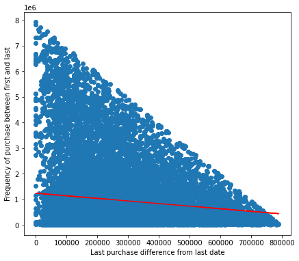

Fig. The linear regression y=mx+c line to predict last purchase diff from transaction frequency Hence, more frequent purchases from a customer is likely to have a more recent purchase.

2. Age and discount applied for swiggy customers

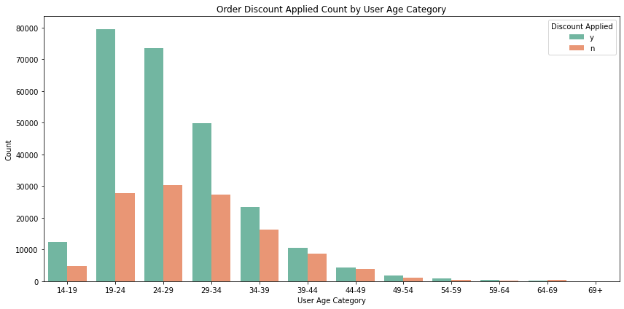

Fig. Count of age groups applying discount on Swiggy orders

From the above bar chart we can see that the majority of Swiggy customers are between the ages of 19 to 34. More than half of these customers avail the use of the discount on Swiggy. So, it can be assumed that the discounts are an important feature for Swiggy.

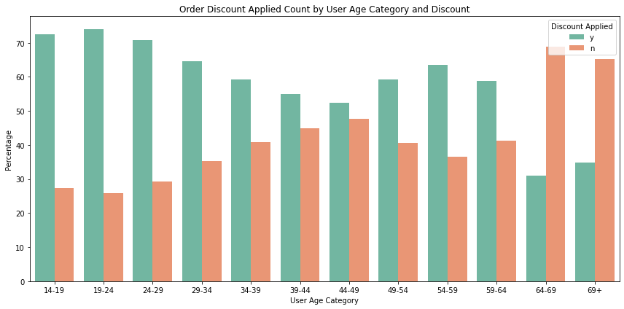

Fig. Percentage within age group of applying discount for Swiggy customers

From the above bar chart we can see that the younger age categories use a great percentage of discounts. The percentage of discount decreases from the age category 19-24 until the age category of 44-49.

The discounts on Swiggy are highly preferred for those between the ages of 14 to 29. The discounts are applied more than half of the time in this age bracket. It would be recommended to promote the discounts more towards this age bracket.

3. Average payment by age and gender

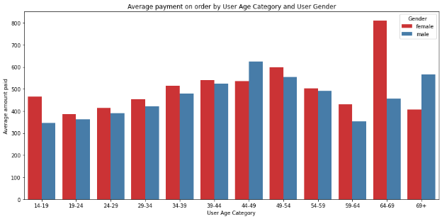

Fig. Average order payment for age group and gender

From this graph we can confirm that females have on average a greater payment on order than males for all age groups except 44-49 and 69+.

It would be beneficial for the companies to invest in bringing more female users as they would be spending more on average.

Further insights to generate:

- Customer segmentation clustering algorithm using K-means or hierarchical clustering
- Customer churn

Predictive analysis![ref1]

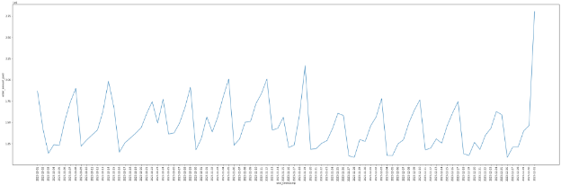

Fig. Sales in time-series line graph from 2023-10-01 until 2023-12-31 Table. Sales calculation for months October, November, December 2023

||**timestamp**|**sales**|
| :- | - | - |
|**0**|2023-10|46058147\.37|
|**1**|2023-11|44335482\.71|
|**2**|2023-12|44073781\.08|

The prediction of sales for the next three months January, February, March 2024 was made using ARIMA, then another one was made using XGBoost.

1. ARIMA

The order (p,d,q) for the ARIMA model was (15, 0, 3).

The data given to the ARIMA model was dataframe with 2 columns. The ‘timestamp’ column contained each date from 2023-10-01 until 2023-12-31. The ‘sales’ column contained the total sales made on that date.

The model was then used to forecast for the next 91 days, from 2024-01-01 until 2024-03-31.

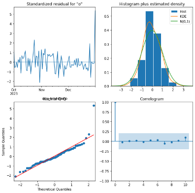

Fig. ARIMA plot diagnostics

Table. ARIMA Sales prediction for months January, February, March 2024

||**timestamp**|**predicted\_mean**|
| :- | - | - |
|**0**|2024-01|45754997|
|**1**|2024-02|42230812|
|**2**|2024-03|45296138|

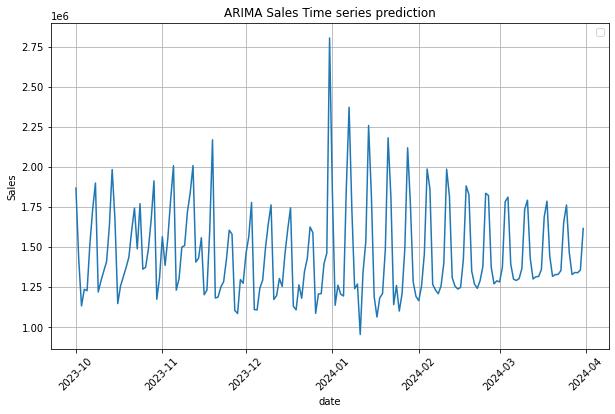

Fig. Daily Sales Predicted using ARIMA

2. XGBoost

The data given to the XGboost model was the ‘year’, ‘month’, ‘day’ column from 2023-10-01 until 2023-12-31, and the ‘sales’ column for each day.

The future data was then predicted using the model for the dates from 2024-01-01 until 2024-03-31.

Table. XGBoost Sales prediction for months January, February, March 2024

||**date**|**predicted\_sales**|
| :- | - | - |
|**0**|2024-01|46058740|
|**1**|2024-02|43572408|
|**2**|2024-03|46058740|

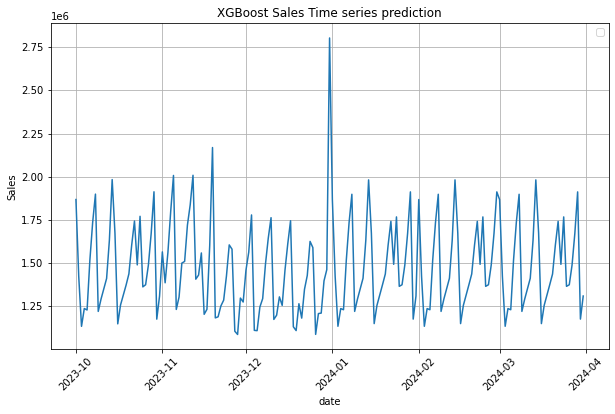

Fig. Daily Sales Predicted using XGBoost

Biases![ref1]

1. There are not enough samples for ‘user\_gender’ as ‘female’. <https://www.similarweb.com/website/swiggy.com/#geography> This link says that swiggy demographics has a 34% female population. Whereas the data has 22% females.
1. Most customers are within the 19-39 age category.
1. There are various ‘nan’ values in various columns.
1. The premium membership details for zomato are unavailable
1. Sampling Bias: The data might be collected from a non-random sample of customers, leading to skewed insights.
1. There could be identical users as they could make both zomato and swiggy transactions.
1. The percentage of swiggy and zomato transactions are not representative of market share.

Extrapolate to real market population:![ref1]

1. Gender extrapolation

<https://www.similarweb.com/website/swiggy.com/#geography> This link says that swiggy demographics has 34% female population and 66% male population. The data does not match that distribution, hence extrapolation is required.

We shall extrapolate the sample data to the actual market population based on the gender category distribution. Further weights can later be applied for different categories such as age category, cities, states, phone type, etc.

male\_percentage\_demo = 0.66 female\_percentage\_demo = 0.34

male\_percentage\_data = male\_population\_in\_data / total\_number\_of\_samples female\_percentage\_data = female\_population\_in\_data / total\_number\_of\_samples

male\_weight = male\_percentage\_demo / male\_percentage\_data female\_weight = female\_percentage\_demo / female\_percentage\_data

The calculation gives us:

**male\_weight = 0.89 female\_weight = 1.57**

These weights are created as a new column. The rows where the gender is male, the male\_weight is given, and the female\_weight where the rows are female.

2. Swiggy and Zomato share extrapolation

([https://www.moneycontrol.com/news/business/why-zomato-continues-to-eat-into-swiggys-mark et-share-10907051.html](https://www.moneycontrol.com/news/business/why-zomato-continues-to-eat-into-swiggys-market-share-10907051.html) , [https://inc42.com/features/the-2023-face-off-how-zomato-powered-past-swiggy-in-the-food-deliv ery-race/](https://inc42.com/features/the-2023-face-off-how-zomato-powered-past-swiggy-in-the-food-delivery-race/) )

Sources suggest that the market share for Zomato and Swiggy is 54% and 46% respectively. This is representative of their gross merchandise value (GMV) at $2.6 billion for Swiggy, as opposed to Zomato’s $3.2 billion in FY2023.

zomato\_market = 0.54 swiggy\_market = 0.46

zomato\_data = zomato\_orders / total\_orders swiggy\_data = swiggy\_orders / total\_orders

zomato\_weight = zomato\_market / zomato\_data swiggy\_weight = swiggy\_market / swiggy\_data

The calculation gives us:

**zomato\_weight = 1.15 swiggy\_weight = 0.87**

3. Sales extrapolation in actual market for real 3 months

([https://inc42.com/features/the-2023-face-off-how-zomato-powered-past-swiggy-in-the-food-deli very-race/](https://inc42.com/features/the-2023-face-off-how-zomato-powered-past-swiggy-in-the-food-delivery-race/) )

Sources suggest that Zomato had 647,000,000 orders in FY23. So, for 3 months the average would be 647000000 \* 3 / 12 = 161,750,000 orders.

Based on the ratio of 0.54:0.46 for Zomato:Swiggy on market share, Swiggy would have 161750000 \* 0.46 / 0.54 = 137,787,037 orders in 3 months.

So, in total there would be 137787037 + 161750000 = 299,537,037 orders in 3 months. The data has a total of 394059 orders for the 3 months Oct-Dec 2023.

The total sales in data is INR 134,467,411.16.

Hence, the total sales for the 3 months Oct-Dec 2023 in the actual market will be:

134467411\.16 \* 299537037 / 394059 = **INR 102,213,044,016**

Food Item order Generator using LLMs and vector embeddings (additional)![ref1]

This application can auto-generate a food order based on your city and certain other preferences.

The application uses:

- Python and pandas to read the Swiggy and Zomato data through a dataframe.
- Similarity search and vector embeddings through sentence-transformers, for suggesting a similar city. The embedding model used here is ‘all-MiniLM-L6-v2’.
- HuggingFace open source LLM Gemma-7b by Google to generate description text for the order.
- HuggingFace open source text-to-image LLM Stable-diffusion to generate an image for the food item order.

The user is first asked to enter the name of the city.

- If the city does not match, it does a similarity search to the vector embeddings of cities in data.

If the city is in data, it searches the data for food product and restaurant options in the city, and provides them to the user for choosing.

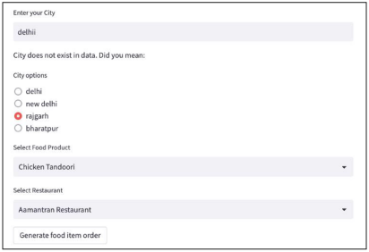

After the User clicks the ‘Generate food item order’ button:

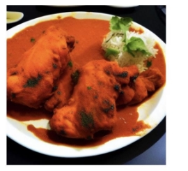

An image of the food item is generated, and

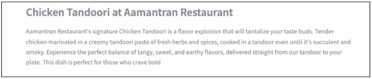

A description of the food item is generated, and

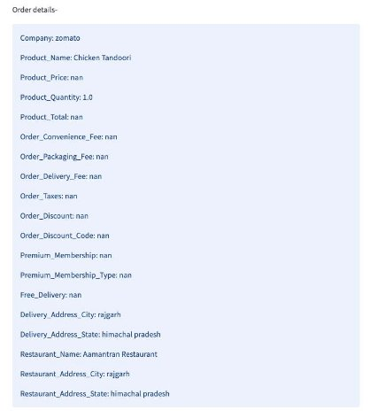

After searching through the data with the city, product\_name, and restaurant. It selects a random transaction, and prints the order details.

Possible improvements to application:

- Adding option for multiple food items
- Faster loading time of dataframe
- Locally hosting or using better LLMs for more or better generated tokens

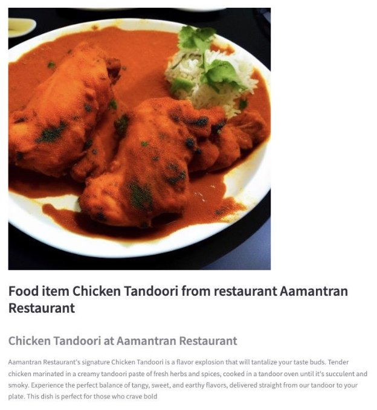

END![ref1]
15

[ref1]: images/Aspose.Words.df5638d8-1f82-4478-b17c-49cd49ff95c0.001.png
